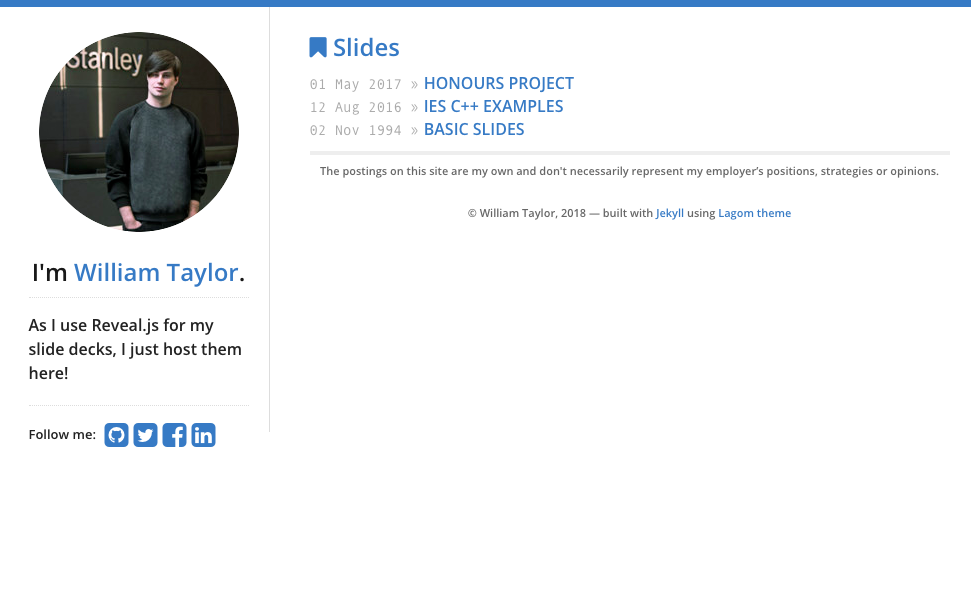

# Slides

Slides is just a Jekyll based website designed to host my web based slide decks that I create. I haven't used it a lot lately as slides I make internally at Morgan Stanley can't be published externally for obvious reasons. I forked the basic swanson/lagom Jekyll theme and altered it to fit what I needed it to do.